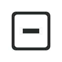

# Vue Popup



[](http://forthebadge.com)
[](http://forthebadge.com)
[](http://forthebadge.com)


> Simple, lightweight and elegant global notification popup for Vue.js

## Install

```
npm install --save vue-popup
```

```javascript
import Vue from 'vue'
// somewhere
import VuePopup from 'vue-popup'

Vue.use(VuePopup)
```

## Usage

Add the `<notification-popup>` component to one point in your application:

```html
<template>
  <div>
    <notification-popup></notification-popup>
  </div>
</template>
```

To trigger the notification use the `$popup` method:

```javascript
export default {
  ...
  methods: {
    notify () {
      this.$popup({ message: 'A message' })
    }
  }
}
```

## API

```javascript
this.$popup(string | Object)

this.$popup('message')

// or

this.$popup({
    message         : 'message',
    color           : '#423452',
    backgroundColor : 'rgba(0, 0, 0, 0.4)',
    delay           : 4
})
```

### Attributes

|Name|type|default|description|
|:--:|:--:|:--:|:---|
|message|string|-|The message that will be displayed in the notification|
|color|string|#ffffff|The text color of the message|
|backgroundColor|string|rgba(0, 0, 0, 0.8)|The background color of the notification|
|delay|float|3.5|How long (in seconds, e.q. 3.5 seconds) should the notification popup be displayed|

## Changelog

* `v0.0.1`
  * initial version

## License

Copyright (c) 2017 Christoph Biering, Licensed under the MIT license.
